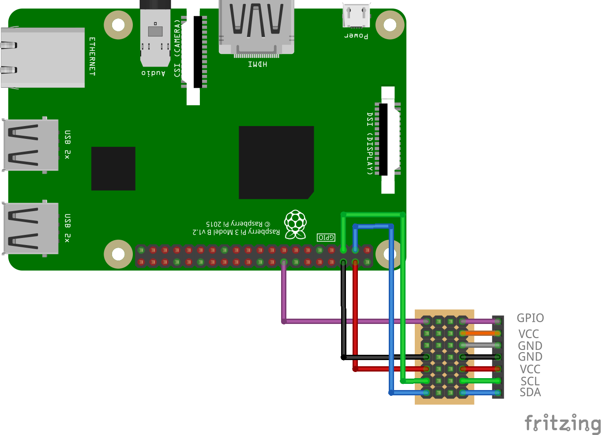

# zakhar_core

Software core for the Zakhar project

Uses the Poetry for dependencies (see: [Poetry - Basic Usage](https://python-poetry.org/docs/basic-usage/#installing-dependencies))

## Hardware

Used Raspberry Pi3 B+

### Current connection

[Current connection in Fritzing](schematic/schematic.fzz)